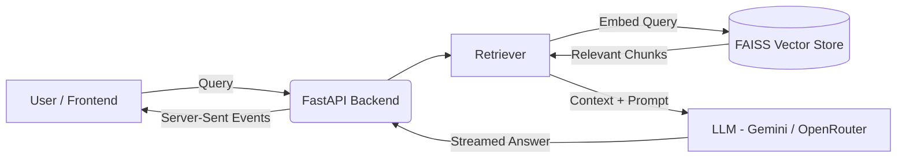

# Personal Portfolio & Elara AI Agent

## 1. Project Overview

This is the personal portfolio website of **Ravindi Gunasekara**, an AI and Computer Vision Engineer. The project goes beyond a static website by integrating an AI-powered conversational agent named **"Elara"**. 

Elara uses Retrieval-Augmented Generation (RAG) to answer questions about the owner's academic background, research interests, projects, and skills. The project solves the problem of static, one-way resumes by allowing recruiters, hiring managers, and collaborators to interactively query and explore the developer's qualifications. It is highly useful because it actively demonstrates the developer's full-stack and AI engineering capabilities in a live production environment.

## 2. Features

- **Interactive AI Chatbot (Elara)**: Streams real-time answers about the developer's skills and projects using RAG.
- **Rich Portfolio Pages**: Dedicated sections for Home, About, Projects, Resume, Lab, and Contact.
- **Project Detail Modals**: Extensive technical descriptions, metrics, and architectures for individual projects.
- **Background Knowledge Ingestion**: Protected endpoint (`/api/sync`) to ingest new data from GitHub repositories and local files.
- **AI Fallback Routing**: Automatic fallback from primary Gemini models to OpenRouter models to ensure high availability.
- **Responsive & Dynamic UI**: Built with Tailwind CSS and Framer Motion for sleek animations and dark mode aesthetics.

## 3. How It Works

When a user asks a question, the request is sent from the Next.js frontend to the FastAPI backend. The backend embeds the user's query and searches a local FAISS vector store for relevant context (e.g., project details, resume info). The retrieved context is combined with a system prompt and sent to the LLM (Google Gemini), which generates an answer. This answer is streamed back to the frontend in real-time.



## 4. Technology Stack

**Frontend Technologies:**
- Next.js 14 (App Router)
- React 18, TypeScript
- Tailwind CSS
- Framer Motion
- Lucide React & React Icons

**Backend Technologies:**
- Python 3
- FastAPI & Uvicorn
- Pydantic Settings

**AI / ML Models:**
- **Primary LLM:** `gemini-3.6-flash`
- **Fallback LLMs:** `gemini-2.5-flash`, `gemini-2.0-flash`, `meta-llama/llama-3.1-8b-instruct:free`, `google/gemma-2-9b-it:free`, `mistralai/mistral-7b-instruct:free`
- **Embedding Model:** `gemini-embedding-2`

**Vector Database:**
- FAISS (Facebook AI Similarity Search)

**APIs & Deployment:**
- Google Gemini API
- OpenRouter API
- GitHub API (for repository knowledge ingestion)
- Vercel (Frontend deployment)

## 5. Setup Instructions

Follow these instructions to reproduce the project locally.

### Prerequisites
- Node.js (v18+)
- Python (3.8+)
- Git

### Repository Setup
```bash
git clone <repository-url>
cd portfolio
```

### Backend Setup

1. **Install dependencies:**
   ```bash
   cd backend
   python -m venv .venv
   # Windows:
   .venv\Scripts\activate
   # macOS/Linux:
   # source .venv/bin/activate
   pip install -r requirements.txt
   ```

2. **Environment Variables:**
   Copy `.env.example` to `.env` and fill in your keys. Do NOT expose real API keys!
   ```env
   # Example .env configuration
   GEMINI_API_KEY="your_google_ai_studio_key"
   OPENROUTER_API_KEY="your_openrouter_key" # Optional fallback
   GITHUB_TOKEN="your_github_token"         # Optional
   SYNC_SECRET="super_secret_sync_key"      # Used to trigger knowledge refresh
   ```

3. **Start the backend server:**
   ```bash
   uvicorn app.main:app --reload
   ```
   The backend will run on `http://localhost:8000`.

### Frontend Setup

1. **Install dependencies:**
   ```bash
   cd frontend
   npm install
   ```

2. **Environment Variables:**
   Copy `.env.example` to `.env.local`:
   ```env
   NEXT_PUBLIC_API_URL="http://localhost:8000"
   ```

3. **Start the frontend server:**
   ```bash
   npm run dev
   ```
   The frontend will run on `http://localhost:3000`.

### Building / Refreshing Knowledge Indexes
To sync the AI agent with new content, trigger the ingestion endpoint while the backend is running:
```bash
curl -X POST http://localhost:8000/api/sync -H "X-Sync-Secret: your_sync_secret_here"
```

## 6. Usage Examples

Once the application is running, open the chat agent on the portfolio and ask realistic questions such as:

- **"What is Ravindi's experience with computer vision?"**
  - *Expectation:* The agent will retrieve details about the Lunar Landing Safety Analysis or Skin Detection projects and summarize the CV techniques used.
- **"Tell me about the multimodal AML cancer classification project."**
  - *Expectation:* The agent will explain the fusion of ResNet50 image features with clinical data and the final XGBoost model results.
- **"What tech stack does Ravindi use for frontend development?"**
  - *Expectation:* The agent will list Next.js, React, Tailwind CSS, etc., based on the portfolio's knowledge base.

## 7. Evaluation

The evaluation focused on testing the portfolio website and Elara AI agent beyond the normal happy path. I tested the application using invalid and empty inputs, repeated interactions, refreshes during responses, rapid submissions, different browser/window conditions, mobile layouts, project links, and other edge cases.

| Evaluation Area                   | Result                                                                                                                           | Status            |
| --------------------------------- | -------------------------------------------------------------------------------------------------------------------------------- | ----------------- |
| Genuinely tried to break the site | Tested links, projects, browsers, mobile layouts, narrow windows, chatbot edge cases, rapid submissions, and form behavior       | ✅ Pass            |
| Real edge cases tested            | Tested empty input, garbage input, repeated questions, refresh during responses, repeated Enter, and other abnormal interactions | ✅ Pass            |
| Basic SEO and metadata            | Added page title, description, Open Graph metadata, and Twitter metadata                                                         | ✅ Pass            |
| Performance testing               | PageSpeed results: Performance 100, SEO 100                                                                                      | ✅ Pass            |
| Findings honestly triaged         | API limitations, refresh interruption, and dummy contact form behavior were documented                                           | ✅ Pass            |
| Fix-now issues addressed          | No confirmed fix-now issues remained after the review                                                                            | ✅ Pass            |
| Known limitations documented      | API quota, refresh interruption, and dummy contact form were identified                                                          | ✅ Pass            |


## 8. Design Decisions

1. **Separation of Frontend and Backend:**
   - *Decision:* The project is split into a Next.js frontend and a FastAPI backend.
   - *Why:* Python is the industry standard ecosystem for AI/ML and vector databases (FAISS, Langchain). Next.js is optimal for high-performance, SEO-friendly React web applications. Separating them allows each tier to use the best-in-class tooling for its domain.

2. **Using FAISS over a Managed Vector Database:**
   - *Decision:* The project uses a local FAISS index stored on disk rather than a cloud vector database like Pinecone or Weaviate.
   - *Why:* The portfolio's knowledge base is relatively small (resume, project readmes, basic details). A local FAISS index eliminates the need for an external database dependency, reduces latency, and keeps deployment simple and free.

## 9. Limitations

- **Knowledge Freshness:** The agent's knowledge is static based on the last ingestion run. If a new project is pushed to GitHub, the `/api/sync` endpoint must be manually triggered.
- **API Availability Risk:** The chatbot relies entirely on external APIs (Google Gemini, OpenRouter). If these APIs experience outages or aggressive rate limiting, the chat functionality will degrade or fail.
- **Hallucination Risk:** Despite the RAG architecture grounding the model, there is always a slight risk the LLM might hallucinate or mix up details between different projects.
- **No Conversation Memory Persistence:** The agent currently does not persist conversation history across different browsing sessions or browser refreshes.

## 10. AI Transparency

AI assistance was utilized during the development of this project. Tools including Google Gemini, ChatGPT, and Antigravity were used for brainstorming, implementation assistance, documentation drafting, and debugging complex configuration issues. 

I personally verified and directed all AI output. Specifically, I reviewed all generated code, manually integrated the components, configured the application environment, tested the functionality locally, made all final architectural design decisions, and validated the final system to ensure it met my professional standards.

## 11. Project Structure

```text
portfolio/
├── backend/
│   ├── app/                # FastAPI logic (routers, config, ingestion script)
│   │   ├── agent/          # RAG pipeline (retriever, LLM chains)
│   │   └── knowledge/      # Raw markdown files (resume, project details)
│   ├── vector_store/       # FAISS index files and chunk mapping JSON
│   ├── requirements.txt    # Python dependencies
│   └── .env                # Backend environment variables
└── frontend/
    ├── public/             # Static assets (CV PDF, project images, OG image)
    ├── src/
    │   ├── app/            # Next.js App Router pages and layout
    │   ├── components/     # Reusable React components (Navbar, ProjectCards)
    │   └── data/           # Hardcoded portfolio data definitions
    ├── package.json        # Node.js dependencies
    └── .env.local          # Frontend environment variables
```

## 12. Deployment

- **Deployment Platform:** Vercel (Frontend)
- **Frontend URL:** [https://ravindi-gunasekara.vercel.app/](https://ravindi-gunasekara.vercel.app/)

## 13. Future Improvements

- Implement GitHub Webhooks to automatically trigger knowledge ingestion when a new repository or commit is pushed.
- Add user-session persistence in the chat interface so visitors don't lose context if they navigate between pages.
- Introduce streaming citation links, allowing the chatbot to natively link to the exact project modal it is referencing.

## 14. Demo

Demo video: [ADD VIDEO LINK]
